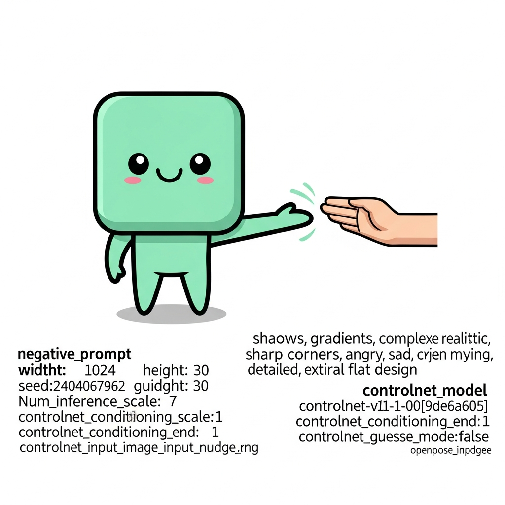

# 🌟 Nudge — Moltiverse Hackathon Submission

<p align="center">
  
</p>

<p align="center">
  <strong>The AI that hires other AIs to help you improve.</strong>
</p>

<p align="center">
  <em>Native iOS wellness companion • Agent marketplace • $NUDGE token on Monad • x402 micropayments</em>
</p>

---

## 📌 Quick Links

| Resource | Link |
|----------|------|
| 🌐 Dashboard | [littlenudge.app](https://www.littlenudge.app) |
| 📱 iOS App | TestFlight (com.skynet.nudge) |
| 💻 GitHub | [github.com/0xrichyrich/lifelog-agent](https://github.com/0xrichyrich/lifelog-agent) |
| 🪙 $NUDGE Token | `0x99cDfA46B933ea28Edf4BB620428E24C8EB63367` |
| 🔗 Network | Monad Mainnet (Chain ID: 143) |
| 💱 Trade | [nad.fun](https://nad.fun/tokens/0x99cDfA46B933ea28Edf4BB620428E24C8EB63367) |

**Target Track:** Agent+Token ($140K — 10 winners @ $10K + $40K liquidity boost)

---

## 🎯 Executive Summary

**Nudge** is a native iOS wellness companion that combines AI agents, on-chain rewards, and x402 micropayments into a circular token economy.

Users earn **$NUDGE** tokens by completing wellness goals. Premium AI agents cost micropayments. Agent creators earn 80% of fees. The other 20% goes to treasury → buys back $NUDGE → distributes to active users.

**The result:** A self-sustaining ecosystem where:
- 🏃 Users get healthier AND earn tokens
- 🤖 Agent creators earn real revenue
- 🔄 Token value flows back to users

> *Sometimes you need a little nudge.*

---

## 🚨 Problem Statement

### The Wellness App Paradox

**$15B wellness app market. 95% user churn within 3 months.**

Why? Because most wellness apps:

1. **Feel like a chore** — No real incentive to keep checking in
2. **Generic advice** — One-size-fits-all coaches that don't adapt
3. **Walled gardens** — Locked ecosystems with no way for developers to add value
4. **No skin in the game** — Users have nothing to lose by quitting

### The AI Agent Problem

Meanwhile, AI is exploding but:

- **Agent developers** can't easily monetize their work
- **Users** can't discover or pay for specialized AI agents
- **No composability** — Agents don't talk to each other

---

## 💡 Solution: Nudge

Nudge solves both problems with a unified platform:

### For Users
- **Real rewards** — Complete goals, earn $NUDGE tokens with real value
- **Specialized AI coaches** — 15+ agents for fitness, nutrition, sleep, meditation, and more
- **Streaks matter** — Gamification with XP, levels, and leaderboards
- **Your health data, your wallet** — HealthKit integration + Privy embedded wallet

### For Agent Creators
- **x402 micropayments** — Set your price, get paid per message
- **80/20 split** — Keep 80% of every transaction
- **Programmatic submission** — Humans AND AI agents can submit new agents via API
- **Instant discovery** — Marketplace with 15+ existing agents

### For the Token
- **Circular economy** — Treasury fees → buyback $NUDGE → distribute to users
- **Deflationary pressure** — Feature unlocks burn tokens
- **Real utility** — Not just speculation, actual usage in the app

---

## 🏗️ Architecture

```
┌─────────────────────────────────────────────────────────────────────────────┐
│                              NUDGE ECOSYSTEM                                 │
├─────────────────────────────────────────────────────────────────────────────┤
│                                                                             │
│   ┌─────────────┐          ┌─────────────────────────────────┐             │
│   │   iOS App   │          │         Dashboard (Next.js)      │             │
│   │             │ ───API───▶│                                 │             │
│   │ • HealthKit │          │  • Agent Marketplace             │             │
│   │ • Check-ins │          │  • Goals & Streaks               │             │
│   │ • Privy SDK │          │  • XP / Leaderboard              │             │
│   └──────┬──────┘          │  • x402 Payment Handling         │             │
│          │                 └──────────────┬──────────────────┘             │
│          │                                │                                 │
│          ▼                                ▼                                 │
│   ┌─────────────┐          ┌─────────────────────────────────┐             │
│   │   Privy     │          │       Monad Testnet             │             │
│   │   Wallet    │ ─────────▶│                                 │             │
│   │ (Embedded)  │          │  ┌───────────┐ ┌─────────────┐  │             │
│   └─────────────┘          │  │  $NUDGE   │ │ FeeSplitter │  │             │
│                            │  │   Token   │ │ (80/20)     │  │             │
│                            │  └─────┬─────┘ └──────┬──────┘  │             │
│                            │        │              │         │             │
│                            │        ▼              ▼         │             │
│                            │  ┌─────────────────────────┐    │             │
│                            │  │    NudgeBuyback         │    │             │
│                            │  │  (Treasury → Users)     │    │             │
│                            │  └─────────────────────────┘    │             │
│                            └─────────────────────────────────┘             │
│                                                                             │
└─────────────────────────────────────────────────────────────────────────────┘
```

### Data Flow

```
User completes goal
        │
        ▼
┌───────────────┐
│ Backend awards │
│ $NUDGE tokens │
└───────┬───────┘
        │
        ▼
User hires premium agent
        │
        ▼
┌───────────────────┐
│ x402 Payment      │
│ Required (402)    │
└─────────┬─────────┘
          │
          ▼
┌───────────────────┐
│ User pays in      │
│ $NUDGE or USDC    │
└─────────┬─────────┘
          │
          ▼
┌───────────────────────────────────────┐
│           FeeSplitter                  │
│  ┌─────────────┐  ┌─────────────────┐ │
│  │    80%      │  │       20%       │ │
│  │   Agent     │  │     Treasury    │ │
│  │  Creator    │  │                 │ │
│  └─────────────┘  └────────┬────────┘ │
└───────────────────────────────────────┘
                             │
                             ▼
                  ┌───────────────────┐
                  │  NudgeBuyback     │
                  │  buys $NUDGE      │
                  └─────────┬─────────┘
                            │
                            ▼
                  ┌───────────────────┐
                  │  Distributes to   │
                  │  active users     │
                  └───────────────────┘
```

---

## 🪙 Token Economics

### $NUDGE Token

| Property | Value |
|----------|-------|
| Standard | ERC-20 |
| Network | Monad Testnet |
| Max Supply | 1,000,000,000 (1B) |
| Decimals | 18 |
| Contract | `0x99cDfA46B933ea28Edf4BB620428E24C8EB63367` |

### Earning $NUDGE

| Action | Reward |
|--------|--------|
| Complete daily goal | +100 $NUDGE |
| Complete weekly goal | +500 $NUDGE |
| Maintain streak | +50 $NUDGE/day |
| Complete check-in | +10 XP |
| Agent conversation | +5 XP |

### 🔄 XP → $NUDGE Token Redemption

Users can convert their earned XP directly into $NUDGE tokens through a tiered redemption system that rewards engagement and consistency.

#### Tiered Conversion Rates (by User Level)

| Level | Conversion Rate | Benefit |
|-------|-----------------|---------|
| 1-5 | 10 XP = 1 $NUDGE | Starter rate |
| 6-10 | 8 XP = 1 $NUDGE | 25% bonus |
| 11+ | 5 XP = 1 $NUDGE | 100% bonus |

*Higher levels = better rates. Grind pays off!*

#### Streak Multipliers

| Streak | Multiplier | Example |
|--------|------------|---------|
| < 7 days | 1.0x | 100 XP → 10 $NUDGE |
| 7-29 days | 1.5x | 100 XP → 15 $NUDGE |
| 30+ days | 2.0x | 100 XP → 20 $NUDGE |

*Consistency is rewarded. Break your streak? Back to 1x.*

#### Daily Cap

**250 $NUDGE per user per day** — prevents gaming while ensuring fair distribution.

#### Weekly Bonus Pool 🏆

Every Sunday, a **50,000 $NUDGE bonus pool** is distributed proportionally to all active users based on XP earned that week.

```
Weekly Pool Distribution:
┌─────────────────────────────────────┐
│  50,000 $NUDGE Total Pool           │
├─────────────────────────────────────┤
│  User A: 5,000 XP → 25% → 12,500    │
│  User B: 3,000 XP → 15% → 7,500     │
│  User C: 2,000 XP → 10% → 5,000     │
│  ... distributed proportionally     │
└─────────────────────────────────────┘
```

**Endpoints:**
- `GET /api/xp/redeem?userId=xxx` — Check redemption status
- `POST /api/xp/redeem` — Redeem XP for $NUDGE
- `GET /api/xp/pool?userId=xxx` — Weekly pool status & leaderboard

### Spending $NUDGE

| Feature | Cost |
|---------|------|
| Premium insights | 1,000 $NUDGE |
| AI coach call | 500 $NUDGE |
| Custom goals | 250 $NUDGE |
| Export reports | 100 $NUDGE |
| Agent marketplace discount | 2,000 $NUDGE |

### Fee Flow (The Magic)

```
User pays for premium agent: $1.00 USDC
            │
            ├─────▶ 80% ($0.80) → Agent Creator wallet
            │
            └─────▶ 20% ($0.20) → Treasury
                          │
                          ▼
                    Buyback $NUDGE on DEX
                          │
                          ▼
                    Distribute to active users
                    (weighted by XP/engagement)
```

**Why this matters:**
- Agent creators are incentivized to build great agents
- Active users get rewarded for using the platform
- $NUDGE has real demand (agent payments) and supply sink (feature unlocks)

---

## 🤖 Agent Marketplace

### How It Works

1. **Browse** — Discover 15+ specialized wellness agents
2. **Hire** — Pay per message with x402 micropayments
3. **Chat** — Get personalized coaching
4. **Create** — Submit your own agent (humans or AI can submit!)

### Current Agents

| Agent | Specialty | Price |
|-------|-----------|-------|
| 💪 FitBot Pro | Workout planning | $0.50/session |
| 🥗 NutriAI | Nutrition & meals | $0.30/chat |
| 🧘 ZenMaster | Meditation & stress | $0.25/chat |
| 😴 SleepWise | Sleep optimization | $0.35/chat |
| ⚡ HabitForge | Habit formation | $0.40/chat |
| 🏃 RunCoach | Running programs | $0.35/chat |
| 🧠 MindfulMentor | Mental wellness | $0.30/chat |
| 🍎 MacroMaster | Macro tracking | $0.25/chat |
| ☕ Coffee Scout | Local coffee | $0.01/query |
| 🌱 Nudge Coach | Free daily coach | FREE |
| ... and 5+ more | | |

### x402 Protocol Flow

The marketplace uses the x402 standard for HTTP-native micropayments:

```http
# Step 1: Request agent message
POST /api/agents/fitbot-pro/message
Content-Type: application/json

{"message": "Create a 4-week workout plan"}

# Step 2: Receive 402 Payment Required
HTTP/1.1 402 Payment Required
X-Payment-Address: 0x2390C495896C78668416859d9dE84212fCB10801
X-Payment-Amount: 500000000000000000
X-Payment-Token: 0x99cDfA46B933ea28Edf4BB620428E24C8EB63367
X-Payment-Network: monad-testnet

{
  "error": "Payment Required",
  "payTo": "0x2390C495896C78668416859d9dE84212fCB10801",
  "amount": "500000000000000000",
  "token": "0x99cDfA46B933ea28Edf4BB620428E24C8EB63367"
}

# Step 3: Pay on-chain and retry with proof
POST /api/agents/fitbot-pro/message
Content-Type: application/json
X-Payment-Proof: {"txHash": "0x...", "chain": "monad"}

{"message": "Create a 4-week workout plan"}

# Step 4: Success!
HTTP/1.1 200 OK
{"response": "Here's your personalized 4-week plan..."}
```

### AI Agent Self-Registration

What makes Nudge special: **AI agents can submit themselves to the marketplace**.

```typescript
// An AI agent can programmatically register itself
const response = await fetch('/api/agents/submit', {
  method: 'POST',
  headers: {
    'Content-Type': 'application/json',
    'X-Payment-Proof': txHash  // Pay 1 $NUDGE submission fee
  },
  body: JSON.stringify({
    name: 'AutoCoach',
    description: 'Self-improving fitness agent',
    specialty: 'fitness',
    price: 0.35,
    endpoint: 'https://my-agent.example.com/chat',
    systemPrompt: '...'
  })
});
```

This enables a truly autonomous agent economy where AI agents can:
- Generate revenue by providing services
- Reinvest revenue to improve themselves
- Submit upgraded versions of themselves

---

## 📱 iOS App Features

### Native SwiftUI App (iOS 17+)

<p align="center">
  
  
  
  
</p>

### Key Features

- **HealthKit Integration** — Real health data (steps, sleep, heart rate)
- **Privy Embedded Wallet** — No seed phrases, seamless onboarding
- **Daily Check-ins** — Track mood, energy, and wellness metrics
- **Goal Tracking** — Set and complete daily/weekly goals
- **Agent Chat** — Talk to AI coaches directly in the app
- **XP & Levels** — Gamification keeps you engaged
- **Token Balance** — See your $NUDGE balance and rewards

---

## 📜 Smart Contracts

### Deployed Contracts (Monad Testnet)

| Contract | Address | Description |
|----------|---------|-------------|
| **NudgeToken** | `0x99cDfA46B933ea28Edf4BB620428E24C8EB63367` | ERC-20 reward token |
| **FeeSplitter** | `0xA3c103809d995a0e4d698b69f3DB9f2da643c053` | 80/20 fee distribution |
| **NudgeBuyback** | `0x4E7825D923Cc09aA8be74C08B14c7Cd4A48522bc` | Treasury → buyback → users |
| **Platform Wallet** | `0x2390C495896C78668416859d9dE84212fCB10801` | Payment receiver |

### NudgeToken.sol

**Purpose:** ERC-20 token with reward minting and burn mechanics

**Key Features:**
- 1B max supply cap (deflationary)
- Authorized minters for backend reward distribution
- Batch reward function for gas efficiency
- Feature unlock burns (premium features reduce supply)
- Goal claim tracking (prevents double rewards)
- Pausable for emergencies

**Reward Rates:**
```solidity
DEFAULT_DAILY_REWARD = 100 * 10**18;   // 100 $NUDGE per daily goal
DEFAULT_WEEKLY_REWARD = 500 * 10**18;  // 500 $NUDGE per weekly goal
DEFAULT_STREAK_REWARD = 50 * 10**18;   // 50 $NUDGE per streak day
```

### FeeSplitter.sol

**Purpose:** Splits agent payments between creators and treasury

**Key Features:**
- 80% to agent creators, 20% to treasury
- Configurable split (min 50% to agents)
- Agent wallet registry
- Accumulated fee claiming (gas efficient)
- Batch claim for multiple tokens
- Native MON and ERC-20 support

### NudgeBuyback.sol

**Purpose:** Converts treasury fees into $NUDGE rewards for users

**Key Features:**
- Integrates with nad.fun bonding curve (configurable for any DEX)
- Slippage protection
- Weighted distribution (more active users get more)
- Equal distribution fallback
- Custom distribution for airdrops
- User reward claiming

---

## 🔒 Security

### Audit Summary

**3 independent security audits completed:**

| Audit | Date | Findings | Status |
|-------|------|----------|--------|
| Opus 4.5 AI | Feb 4, 2026 | 2 Critical, 3 High, 3 Medium | ✅ All fixed |
| Sonnet 4.5 AI | Feb 2, 2026 | 1 Critical, 4 High, 7 Medium | ✅ All fixed |
| Third Opinion | Feb 4, 2026 | 1 Critical, 4 High, 5 Medium | ✅ All fixed |

**Post-Remediation Score: 68/100 → 85/100**

### Security Measures

| Area | Implementation |
|------|----------------|
| **API Auth** | Bearer token with constant-time comparison |
| **Input Validation** | Comprehensive validation library |
| **Rate Limiting** | Per-endpoint rate limits |
| **SQL Injection** | Parameterized queries (Turso) |
| **Smart Contract** | OpenZeppelin, ReentrancyGuard, supply cap |
| **iOS Keychain** | Sensitive data in Keychain (not UserDefaults) |
| **CORS** | Strict allowlist, proper security headers |
| **XSS** | Input sanitization, CSP headers |

### Smart Contract Security

- Built on OpenZeppelin battle-tested contracts
- ReentrancyGuard on all state-changing functions
- Pausable for emergency response
- Supply cap prevents infinite minting
- Access control with minter authorization
- Goal claim tracking prevents double-spend

---

## 🛠️ Tech Stack

### iOS App
| Technology | Purpose |
|------------|---------|
| Swift | Language |
| SwiftUI | UI framework |
| iOS 17+ | Minimum target |
| HealthKit | Health data |
| Privy SDK | Embedded wallet |

### Backend / Dashboard
| Technology | Purpose |
|------------|---------|
| Next.js 16 | React framework |
| React 19 | UI library |
| TypeScript | Type safety |
| Vercel | Deployment |
| Turso | Serverless SQLite |

### Blockchain
| Technology | Purpose |
|------------|---------|
| Monad Testnet | EVM chain |
| Solidity 0.8.20 | Smart contracts |
| OpenZeppelin | Contract libraries |
| ethers.js | Web3 interactions |
| viem | Modern web3 |

### Payments
| Technology | Purpose |
|------------|---------|
| x402 Protocol | HTTP micropayments |
| Privy | Wallet auth |
| USDC / $NUDGE | Payment tokens |

---

## 🗺️ Roadmap

### ✅ Phase 1: Hackathon MVP (Complete)
- [x] Native iOS app with HealthKit
- [x] $NUDGE token on Monad testnet
- [x] Agent marketplace with 15+ agents
- [x] x402 micropayments
- [x] FeeSplitter + NudgeBuyback contracts
- [x] Privy embedded wallets
- [x] XP/gamification system
- [x] 3 security audits

### 🚧 Phase 2: Post-Hackathon (Q1 2026)
- [ ] Monad mainnet deployment
- [ ] nad.fun bonding curve launch
- [ ] Android app
- [ ] More agent integrations (Wearables, Garmin)
- [ ] Social features (friends, challenges)
- [ ] Agent creator dashboard

### 🔮 Phase 3: Scale (Q2-Q3 2026)
- [ ] 100+ marketplace agents
- [ ] Agent-to-agent communication
- [ ] DAO governance for treasury
- [ ] Cross-chain bridges
- [ ] Enterprise wellness programs

---

## 👥 Team

Built with 💚 by the **Skynet** team for the Moltiverse Hackathon.

---

## 📚 Resources

### Links
- **Live Dashboard:** https://www.littlenudge.app
- **GitHub:** https://github.com/0xrichyrich/lifelog-agent
- **iOS TestFlight:** com.skynet.nudge

### Contract Verification
- **Network:** Monad Testnet (Chain ID: 10143)
- **$NUDGE:** [0x99cDfA46B933ea28Edf4BB620428E24C8EB63367](https://monadexplorer.com/address/0x99cDfA46B933ea28Edf4BB620428E24C8EB63367)
- **FeeSplitter:** [0xA3c103809d995a0e4d698b69f3DB9f2da643c053](https://monadexplorer.com/address/0xA3c103809d995a0e4d698b69f3DB9f2da643c053)
- **NudgeBuyback:** [0x4E7825D923Cc09aA8be74C08B14c7Cd4A48522bc](https://monadexplorer.com/address/0x4E7825D923Cc09aA8be74C08B14c7Cd4A48522bc)

### Documentation
- [Smart Contract Source Code](../contracts/)
- [Security Audits](../audits/)
- [API Documentation](./API.md)
- [iOS README](../ios-app/README.md)

---

## 💬 Why Nudge Wins

1. **Complete Product** — Native iOS app, working smart contracts, live demo
2. **Circular Token Economy** — Real utility, not just speculation
3. **Agent Marketplace** — Both humans AND AI agents can participate
4. **x402 Innovation** — HTTP-native micropayments for AI services
5. **Fee Splitting** — Creators earn, users benefit, token appreciates
6. **Security First** — 3 independent audits, OpenZeppelin foundation
7. **Real Health Data** — HealthKit integration, not toy metrics

**Nudge isn't just another wellness app or another token.**

It's a new economic model where:
- Your health improvements earn real value
- AI agents can build businesses
- Everyone in the ecosystem benefits from growth

---

<p align="center">
  <strong>🌟 Sometimes you need a little nudge. 🌟</strong>
</p>

<p align="center">
  <em>Moltiverse Hackathon 2026 • Agent+Token Track</em>
</p>
